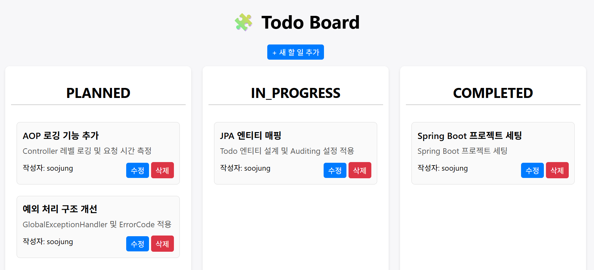

# 🧩 Skeleton Project for Todo Board

## 프로젝트 개요

> 단일 테이블 기반의 간단한 **Todo CRUD API 서버**를 구현하되,  
> 동시에 **공통화, error handling, package layer, logging**을 고려한 스켈레톤 프로젝트



### 기술 스택

| 구분         | 사용 기술                             |
| ---------- |-----------------------------------|
| Language   | Java 21                           |
| Framework  | Spring Boot 3.5.7 (Gradle)        |
| Database   | H2 Database (in-memory)           |
| ORM        | Spring Data JPA                   |
| Logging    | AOP LoggingAspect, SLF4J, Logback |
| Validation | Spring Boot Starter Validation    |
| Test       | JUnit 5, Mockito                  |
| View       | Thymeleaf                         |


### 테이블 설계

| column     | type                                        | description |
| ---------- | ------------------------------------------- | ----------- |
| id         | BIGINT (PK, AUTO_INCREMENT)                 | 식별자         |
| user_id    | VARCHAR(50)                                 | 작성자 ID      |
| title      | VARCHAR(100)                                | 할 일 제목      |
| content    | TEXT                                        | 할 일 내용      |
| status     | ENUM('PLANNED', 'IN_PROGRESS', 'COMPLETED') | 할 일 상태      |
| created_at | TIMESTAMP                                   | 생성일         |
| updated_at | TIMESTAMP                                   | 수정일         |


### API 명세

---

### 프로젝트 구조

```bash
com.example.todo
 ├── common                  # 공통 처리 (예외, 응답, 로깅, 설정)
 │    ├── config
 │    │    ├── BaseEntity.java
 │    │    ├── JpaAuditConfig.java
 │    │    └── LoggingAspect.java
 │    ├── exception
 │    │    └── GlobalExceptionHandler.java
 │    └── response
 │         ├── ApiResponse.java
 │         └── ErrorCode.java
 │
 ├── controller               # API 및 View Controller
 │    ├── TodoController.java
 │    └── TodoViewController.java
 │
 ├── domain                   # Entity + Repository
 │    ├── Todo.java
 │    ├── TodoRepository.java
 │    └── TodoStatus.java
 │
 ├── dto                      # Request / Response DTO
 │    ├── request
 │    │    ├── TodoRequest.java
 │    │    └── TodoUpdateRequest.java
 │    └── response
 │         └── TodoResponse.java
 │
 ├── service                  # business logic
 │    ├── TodoService.java
 │    └── TodoServiceImpl.java
 │
 └── TodoApplication.java
```

---
## 상세 설계

### 공통 응답 구조

**ApiResponse.java**

```java
@Getter
@NoArgsConstructor
public class ApiResponse<T> implements Serializable {
    private static final String SUCCESS_STATUS = "C000";
    private String status;
    private T data;
    private String message;

    public static <T> ApiResponse<T> createSuccess(T data, String message) {
        return new ApiResponse<>(SUCCESS_STATUS, data, message);
    }

    public static ApiResponse<?> createError(ErrorCode errorCode) {
        return new ApiResponse<>(errorCode.getCode(), null, errorCode.getMessage());
    }
}
```

**ErrorCode.java**

```java
@Getter
@RequiredArgsConstructor
public enum ErrorCode {
    INTERNAL_SERVER_ERROR("C001", HttpStatus.INTERNAL_SERVER_ERROR, "서버 오류 발생"),
    RESOURCE_NOT_FOUND("C003", HttpStatus.NOT_FOUND, "요청한 리소스를 찾을 수 없습니다."),
    USER_NOT_FOUND("U002", HttpStatus.NOT_FOUND, "사용자를 찾을 수 없습니다.");
    ...
}
```

---

### 전역 예외 처리 (GlobalExceptionHandler)

```java
@RestControllerAdvice
@Slf4j
public class GlobalExceptionHandler {

    /**
     * Valid  검증 실패
     */
    @ExceptionHandler(MethodArgumentNotValidException.class)
    public ResponseEntity<ApiResponse<?>> handleValidationException(MethodArgumentNotValidException e) {
        String message = e.getBindingResult().getAllErrors().getFirst().getDefaultMessage();
        return ResponseEntity
                .status(ErrorCode.USER_REGISTER_FAILED.getHttpStatus())
                .body(ApiResponse.createErrorWithCustomMessage(ErrorCode.USER_REGISTER_FAILED, message));
    }

    /**
     * 리소스 조회 실패
     */
    @ExceptionHandler(IllegalArgumentException.class)
    public ResponseEntity<ApiResponse<?>> handleIllegalArgumentException(IllegalArgumentException e) {
        return ResponseEntity
                .status(ErrorCode.RESOURCE_NOT_FOUND.getHttpStatus())
                .body(ApiResponse.createErrorWithCustomMessage(ErrorCode.RESOURCE_NOT_FOUND, e.getMessage()));
    }

    /**
     * 그 외 모든 예외
     */
    @ExceptionHandler(Exception.class)
    public ResponseEntity<ApiResponse<?>> handleException(Exception e) {
        return ResponseEntity
                .status(ErrorCode.INTERNAL_SERVER_ERROR.getHttpStatus())
                .body(ApiResponse.createError(ErrorCode.INTERNAL_SERVER_ERROR));
    }
}
```

---

### BaseEntity (공통 Entity)

```java
@MappedSuperclass
@EntityListeners(AuditingEntityListener.class)
public abstract class BaseEntity {

    @CreatedDate
    @Column(updatable = false)
    private LocalDateTime createdAt;

    @LastModifiedDate
    private LocalDateTime updatedAt;
}
```

---

### LoggingAspect (AOP 로그)

```java
@Aspect
@Component
@Slf4j
public class LoggingAspect {

    @Around("execution(* com.example.todo.controller..*(..))")
    public Object logController(ProceedingJoinPoint proceedingJoinPoint) throws Throwable {

        long start = System.currentTimeMillis();
        log.info("[START] {} args={}", proceedingJoinPoint.getSignature(), Arrays.toString(proceedingJoinPoint.getArgs()));

        // method info
        Method method = getMethod(proceedingJoinPoint);
        log.info("======= method name = {} =======", method.getName());

        // parameter
        Object[] args = proceedingJoinPoint.getArgs();
        if (args != null && args.length > 0) {
            log.info("======= method args = {} =======", Arrays.toString(args));
        } else {
            args = null;
        }

        // method proceed()
        Object returnObj = args != null ? proceedingJoinPoint.proceed(args) : proceedingJoinPoint.proceed();

        // return
        if (returnObj != null) {
            log.info("return type = {}", returnObj.getClass().getSimpleName());
            log.info("return value = {}", returnObj);
        } else {
            log.info("return value = null");
        }

        long end = System.currentTimeMillis();
        log.info("[END] {} took={}ms", proceedingJoinPoint.getSignature(), (end - start));

        return returnObj;
    }
}
```

---

## how to run

```bash
# 프로젝트 실행
./gradlew bootRun

# 브라우저 접속
http://localhost:8080/todos

# API 문서
http://localhost:8080/swagger-ui/index.html

# H2 콘솔
http://localhost:8080/h2-console
```

